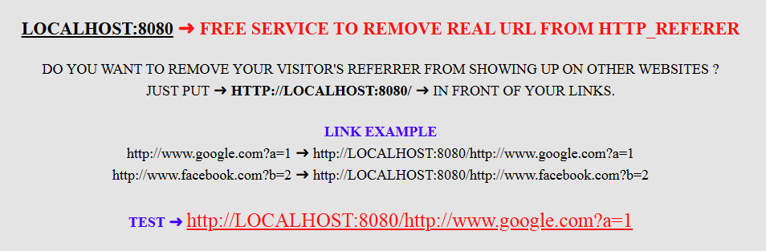

> PROVIDES YOU WITH THE SECURITY OF HIDING YOUR VISITORS REFER FROM BEING SEEN BY OTHER WEBSITES

## 🚀 QUICK START

```bash
# INSTALL DEPENDENCIES
npm install

# START SERVER
npm start
```

THAT'S IT! YOUR WEBSITE WILL BE RUNNING AT `HTTP://LOCALHOST:8080`

## 📄 LICENSE

MIT
